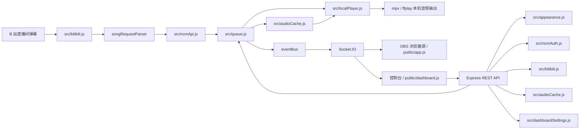

# Bilibiliwith163 架构文档

更新时间：2026-05-30

本文档描述 Bilibiliwith163 的当前模块划分、主要依赖、运行流程、业务逻辑、文件地图和常见修改入口。日常维护优先阅读本文、`TODO.md` 和 `WORK_HISTORY.md`；旧优化清单统一放在 `history/` 作为参考。

## 文档结构

```text
docs/
├─ README.md        # 文档入口、阅读顺序和工作流程
├─ TODO.md          # 当前待办、优先级、复杂度和验收标准
├─ ARCHITECTURE.md  # 当前架构、数据流、接口、模块职责和 Git 基线
├─ WORK_HISTORY.md  # 已完成工作、关键决策、验证结果和剩余边界
└─ history/         # 旧优化清单、阶段记录和历史参考
```

`docs/history/OPTIMIZATION-2026-05-25.md` 由旧 `docs/OPTIMIZATION.md` 迁移而来；当前待办以 `docs/TODO.md` 为准。

## 目标

项目目标是完成一套直播间弹幕点歌系统：

1. 直接连接指定 B 站直播间的实时弹幕。
2. 从弹幕中识别点歌指令。
3. 使用仍在维护的网易云音乐开源 API 获取歌曲信息和播放地址。
4. 通过后端本地播放器输出音频，通过浏览器源为 OBS 或直播姬提供播放状态组件。
5. 通过控制台完成房间切换、网易云登录、队列控制和外观编辑。

## 主要依赖

| 依赖 | 用途 |
| --- | --- |
| `express` | HTTP 服务、静态文件、REST API |
| `socket.io` | 服务端向控制台和 OBS 源实时推送状态 |
| `bilibili-live-danmaku` | B 站直播间初始化、弹幕 WebSocket 连接 |
| `@neteasecloudmusicapienhanced/api` | 网易云音乐搜索、播放地址、二维码登录 |
| `ws` | 为 B 站弹幕库提供 WebSocket 运行环境 |
| `dotenv` | 读取 `.env` 配置 |
| `mpv` / `ffplay` | 后端调用的本机音频播放器，推荐 `mpv` |
| `7zip-bin` | 自动安装便携版 `mpv` 时解压 `.7z` 包 |
| `@appthreat/caxa` | 简单 exe 打包路线，将项目和 Node 运行时打进自解压 exe |

## 目录结构

```text
.
├─ public/
│  ├─ index.html          # OBS / 直播姬浏览器源页面
│  ├─ shared.js           # OBS 源和控制台共享前端工具函数
│  ├─ app.js              # OBS 点歌器状态展示逻辑
│  ├─ dashboard.html      # 控制台页面
│  ├─ dashboard.js        # 控制台前端逻辑
│  ├─ style.css           # OBS 源和控制台共享样式
│  └─ placeholder.svg     # 默认封面
├─ pic/
│  ├─ fu.png              # 控制台固定壁纸
│  └─ miku.jpg            # 播放器预览底图候选；若存在 miku.png 会优先尝试
├─ scripts/
│  └─ watch-bilibili.js   # B 站弹幕监听调试脚本
├─ src/
│  ├─ server.js           # HTTP + Socket.IO 入口
│  ├─ index.js            # 第三方引用入口；无副作用导出解析/helper
│  ├─ runtimePaths.js     # 源码运行和 exe 打包运行的路径解析
│  ├─ config.js           # 环境变量配置
│  ├─ bilibili.js         # B 站直播间连接和弹幕处理
│  ├─ bilibiliHelpers.js  # B 站命令、弹幕、地址、Cookie 辅助解析
│  ├─ ncmApi.js           # 网易云搜索、可用性检查、播放地址
│  ├─ ncmAuth.js          # 网易云二维码登录和 Cookie 持久化
│  ├─ queue.js            # 当前播放、候选队列、历史记录
│  ├─ audioCache.js       # 音频本地缓存和 Range 播放
│  ├─ localPlayer.js      # 后端本地 mpv/ffplay 播放控制
│  ├─ playerInstaller.js  # 便携版 mpv 下载和安装
│  ├─ appearance.js       # OBS 点歌器外观配置
│  ├─ dashboardSettings.js# 控制台设置存储
│  ├─ eventBus.js         # 进程内事件总线
│  └─ songRequestParser.js# 弹幕点歌指令解析
└─ test/
   └─ api-smoke.js        # 网易云和 B 站 API 冒烟测试
```

## 本地 Git 保护基线

本项目使用本地 Git 仓库作为恢复点。首次备份提交完成后，本节记录基线信息；后续每个独立 TODO 或可独立验收的子任务完成后建议再创建一次提交。

当前仓库基线：

```text
branch: main
baseline_commit: f82a12d chore: initialize local git baseline
user.name: Bilibiliwith163 Local
user.email: bilibiliwith163-local@example.invalid
core.autocrlf: false
remote: origin https://github.com/Minirylai/Bilibiliwith163.git
```

相关文件：

```text
.gitignore       排除 .env、.cache、node_modules、日志和运行产物
.env.example     只保留占位配置，不允许写入真实 Cookie
```

维护规则：

- 开始任务前执行 `git status --short`，确认工作区状态。
- 文档记录负责说明目标、边界和验证结果，Git 提交负责提供可恢复状态。
- 未经用户明确要求，不使用 `git reset --hard`、`git checkout -- <file>` 等会丢弃改动的命令。

## 当前功能与代码模块映射

| 功能 | 用户入口 / API | 主要代码模块 | 当前状态 |
| --- | --- | --- | --- |
| B 站房间连接 | 启动服务、`GET /api/bilibili/room` | `src/server.js`、`src/bilibili.js`、`src/config.js` | 启动时自动连接 `.env` 中的房间号，并向前端广播连接、心跳、最近弹幕和错误状态。 |
| B 站房间切换 | 控制台房间表单、`POST /api/bilibili/room` | `src/server.js`、`src/bilibili.js` | 可运行时切房并写回 `.env`；当前没有自动重连，连接失败时存在内存状态先更新的风险。 |
| 弹幕点歌识别 | 直播间 `DANMU_MSG` | `src/bilibili.js`、`src/bilibiliHelpers.js`、`src/songRequestParser.js`、`src/queue.js` | 支持 `REQUEST_COMMANDS` 配置的指令前缀，解析出关键词后进入冷却、搜索和入队流程。 |
| 网易云搜索与解析 | 弹幕点歌、`GET /api/search`、`POST /api/request` | `src/ncmApi.js`、`src/ncmAuth.js` | 使用网易云增强 API 搜索、检查可播性并获取播放地址；播放音质和缓存音质可独立配置，优先保证直播播放流畅。 |
| 网易云扫码登录 | 控制台网易云登录区、`/api/ncm/login/*` | `src/ncmAuth.js`、`src/server.js`、`public/dashboard.js` | 生成二维码、轮询扫码状态、保存或清除 `NCM_COOKIE`；会员歌曲仍取决于账号权限和接口返回。 |
| 队列与播放状态 | `GET /api/state`、`POST /api/next`、`POST /api/skip`、`POST /api/clear`、`POST /api/reset`、`POST /api/queue/:requestId/remove` | `src/queue.js`、`src/eventBus.js`、`src/server.js` | 维护当前播放、候选队列和历史记录，并通过 Socket.IO 推送 `queue:state`、`player:play`、`player:idle`。 |
| 后端本地播放 | `GET /api/player`、`POST /api/player/toggle`、`POST /api/player/pause`、`POST /api/player/resume`、`POST /api/player/stop` | `src/localPlayer.js`、`src/audioCache.js`、`src/server.js` | 后端收到播放事件后调用本机 `mpv` 或 `ffplay` 播放本地缓存文件；缓存未完成时播放本地代理 URL，并推送 `player:state`。 |
| 便携播放器安装 | `GET /api/player/install`、`POST /api/player/install` | `src/playerInstaller.js`、`src/localPlayer.js`、`src/server.js` | 缺少播放器时可从 GitHub 下载 shinchiro Windows `mpv` 构建，解压到 `.cache/player/mpv/`，不写系统 PATH。 |
| 音频缓存与播放代理 | `GET /api/audio/:requestId`、`GET /api/cache`、`POST /api/cache/cleanup` | `src/audioCache.js`、`src/queue.js`、`src/server.js` | 为每次点歌生成本地播放代理地址，按歌曲生成可读缓存文件名，同歌复用缓存，支持 HTTP Range、缓存清理和退出歌单后的引用释放回收。 |
| OBS / 直播姬浏览器源 | `/` | `public/index.html`、`public/shared.js`、`public/app.js`、`public/style.css` | 接收实时队列和本地播放器状态，只展示封面、标题、歌手、点歌来源、进度条、候选队列、播报栏和控制按钮，不再输出音频。 |
| OBS 外观配置 | 控制台编辑器、`/api/appearance*` | `src/appearance.js`、`public/shared.js`、`public/dashboard.js`、`public/app.js`、`public/style.css` | 可调整尺寸、毛玻璃、字号、字体、颜色和播放器/候选框/播报栏圆角；当前配置与保存方案分别落盘到 `.cache/appearance.json` 和 `.cache/appearance.saved.json`。 |
| 控制台监控与控制 | `/dashboard.html` | `public/dashboard.html`、`public/shared.js`、`public/dashboard.js`、`src/server.js` | 展示当前播放、弹幕/请求日志、队列、房间状态，支持切歌、清空、停止、切房、网易云登录和外观编辑。 |
| 控制台设置和壁纸能力 | `GET/POST /api/dashboard-settings`、`GET /api/wallpapers` | `src/dashboardSettings.js`、`src/server.js`、`public/dashboard.js`、`public/style.css` | 服务端保留设置和壁纸列表能力；当前前端主流程固定使用 `pic/fu.png`，播放器预览底图优先尝试 `pic/miku.png` 后回退 `pic/miku.jpg`。 |
| 第三方引用 | `require("bilibiliwith163")` | `src/index.js`、`src/songRequestParser.js`、`src/bilibiliHelpers.js` | 包根入口无副作用，不启动 HTTP 服务或连接 B 站；导出点歌解析和 B 站消息辅助函数。 |
| 本地模拟和调试 | `POST /api/mock-danmaku`、`npm run debug:bili`、`npm test` | `src/server.js`、`scripts/watch-bilibili.js`、`test/api-smoke.js` | 支持模拟弹幕、单独监听 B 站弹幕，以及对网易云和 B 站外部 API 做冒烟检查。 |

## 静态架构检查结论

本次静态检查时间为 2026-05-25。检查范围为 `docs/`、`src/`、`public/`、`scripts/` 和 `test/`，未修改源代码行为。

架构总体符合目标链路：B 站弹幕输入、点歌指令解析、网易云搜索和播放地址解析、队列状态管理、音频缓存代理、本地播放器输出、Socket.IO 推送、OBS 源状态展示和控制台管理都能在代码中找到明确模块。后端模块边界基本清晰，`src/server.js` 负责组合 HTTP/Socket/API，`src/bilibili.js` 负责弹幕接入，`src/ncmApi.js` 和 `src/ncmAuth.js` 负责网易云能力，`src/queue.js` 负责运行时播放状态，`src/audioCache.js` 负责本地音频代理，`src/localPlayer.js` 负责调用本机播放器。

当前存在的冗余或维护风险：

- `public/style.css` 已有多段 `Final overrides` / `EOF override` 覆盖块，说明样式依赖末尾覆盖来修正前文规则，后续维护容易继续堆叠。该问题已在 `docs/TODO.md` 作为 P0 记录。
- 外观默认值和字段处理同时存在于 `src/appearance.js`、`public/dashboard.js` 和 `public/app.js`，属于前后端 schema 重复；后续新增字段时需要同步三处。
- `src/dashboardSettings.js`、`GET /api/dashboard-settings`、`GET /api/wallpapers` 和禁用的 `POST /api/wallpapers/upload` 仍保留，但当前控制台主流程固定壁纸，没有完整的壁纸选择或上传 UI。
- 外观默认值和字段处理同时存在于 `src/appearance.js`、`public/dashboard.js` 和 `public/app.js`，属于前后端 schema 重复；后续新增字段时需要同步三处。
- 手动点歌接口 `POST /api/request` 已存在，但控制台没有手动搜索/插入入口；目前更像调试或外部集成接口。

## 运行时组件



## 启动流程

1. `src/server.js` 读取 `.env`，创建 Express 和 Socket.IO 服务。
2. Express 暴露 `public/` 静态页面和 `/pic` 壁纸目录。
3. `startBilibili()` 使用配置中的 `BILI_ROOM_ID` 建立 B 站弹幕连接。
4. 服务端启动后输出：
   - OBS 源：`http://localhost:3888/`
   - 控制台：`http://localhost:3888/dashboard.html`
5. 新的 Socket.IO 客户端连接时，会立即收到：
   - `queue:state`
   - `appearance:state`
   - 当前 B 站连接状态

## 运行路径和 exe 打包

`src/runtimePaths.js` 统一管理源码运行和 exe 打包运行时的路径：

- 源码运行时，运行根目录是项目根目录。
- `pkg` 打包运行时，运行根目录是可执行文件所在目录。
- `caxa` 打包运行时，`scripts/caxa-entry.js` 会把启动工作目录写入 `BILIBILIWITH163_RUNTIME_ROOT`，运行根目录就是 exe 启动目录。
- `.env`、`.cache/`、外观配置、控制台设置和音频缓存始终写入运行根目录。
- `public/` 和 `pic/` 优先读取运行根目录下的外部目录；不存在时回退到打包快照内的内置资源。

推荐的简单打包命令是：

```powershell
npm run build:exe:caxa
```

该命令会创建 `dist/caxa-input/` 临时目录，只安装生产依赖，然后用 `@appthreat/caxa` 生成 `dist/bilibiliwith163-caxa.exe`。这种方式不编译 Node 源码，不需要 NASM，产物本质是“Node 运行时 + 项目文件”的自解压 exe。`@appthreat/caxa` 构建阶段要求 Node.js 22.15 或更高版本；当前本机验证生成的 exe 约 64.6 MB。

保留的高级打包命令是：

```powershell
npm run build:exe
```

它使用 `@yao-pkg/pkg` 生成 Windows x64 可执行文件，输出目标为 `dist/bilibiliwith163.exe`。如果 `pkg` 无法下载预编译 Node 基础镜像，会尝试源码构建；Windows 源码构建需要 `patch`、`NASM` 和完整编译工具链。

## 弹幕点歌流程

1. `bilibili-live-danmaku` 收到直播间消息。
2. `src/bilibili.js` 过滤 `DANMU_MSG`，提取弹幕文本和用户信息。
3. `src/songRequestParser.js` 判断弹幕是否以点歌指令开头。
4. `src/queue.js` 先检查用户点歌冷却。
5. `src/ncmApi.js` 调用网易云：
   - `cloudsearch` 搜索歌曲
   - `check_music` 检查可用性
   - `song_url_v1` 获取播放地址
6. `src/queue.js` 创建队列项和 `requestId`。
7. `src/audioCache.js` 注册播放地址并预热缓存。
8. 成功入队后 `src/queue.js` 提交用户冷却记录。
9. `eventBus` 发出 `request:accepted`、`queue:state`、`player:play`。
10. `src/localPlayer.js` 收到 `player:play` 后优先选择完整本地缓存文件；如果缓存未完成，播放 `http://127.0.0.1:<PORT>/api/audio/<requestId>` 代理 URL。
11. OBS 源和控制台收到 Socket.IO 事件，只更新当前播放状态、进度和队列显示。

## 队列和播放逻辑

`src/queue.js` 维护三个核心状态：

- `current`：当前歌曲
- `queue`：待播队列
- `history`：最近播放历史
- `lastRequestByUser`：用户最近一次通过冷却检查的时间

关键行为：

- 队列为空时新增歌曲会立即成为 `current` 并触发 `player:play`。
- 队列非空时新增歌曲进入候选队列。
- `MAX_QUEUE_SIZE` 表示当前播放歌曲加候选队列的总量。
- `nextSong()` 会把当前歌曲写入历史，然后播放下一首。
- `skipSong()` 是 `nextSong()` 的别名。
- `resetPlayback()` 停止当前播放并清空队列。
- `removeQueuedSong()` 只移除候选队列中的歌曲。
- `history` 内部最多保留 `MAX_HISTORY_ITEMS` 条记录；`publicState()` 仍只返回最近 20 条，保持前端兼容。
- `canUserRequest()` 每次检查时会清理超过 `USER_COOLDOWN_TTL_MS` 的用户冷却记录；实际 TTL 不会小于 `MIN_REQUEST_INTERVAL_MS`。
- `commitUserRequest()` 只在歌曲成功入队后调用；搜索失败、不可播、重复歌曲或队列满不会消耗用户冷却。

## 后端本地播放逻辑

`src/localPlayer.js` 负责后端音频输出：

- 默认使用 `AUDIO_OUTPUT_MODE=local`。
- 自动探测 `mpv`，找不到时再尝试 `ffplay`；也可以用 `LOCAL_PLAYER_BACKEND` 指定后端。
- 如果播放器不在 PATH 中，可以用 `LOCAL_PLAYER_PATH` 指向 `mpv.exe` 或 `ffplay.exe`。
- 如果没有本机播放器，控制台可以调用 `POST /api/player/install` 安装便携版 `mpv` 到 `.cache/player/mpv/`；`LOCAL_PLAYER_AUTO_INSTALL=true` 时也可在服务启动时自动安装。
- 新歌开始时，优先播放已经完整落盘的缓存文件。
- 缓存尚未完成时，播放本服务的 `/api/audio/:requestId` 代理 URL，避免把网易云外链直接暴露给播放器。
- `mpv` 使用 IPC 控制暂停、继续和进度读取；`ffplay` 作为兜底播放后端，暂停/继续能力是尽力而为。
- 播放器自然退出后，服务端会触发 `queue.nextSong()` 进入下一首。
- 手动下一首、停止或清空时，队列仍是单一状态源，`localPlayer` 只负责停止旧进程并播放新目标。

播放器状态通过 `player:state` Socket.IO 事件广播，REST 控制入口包括：

- `GET /api/player`
- `GET /api/player/install`
- `POST /api/player/install`
- `POST /api/player/toggle`
- `POST /api/player/pause`
- `POST /api/player/resume`
- `POST /api/player/stop`

## B 站辅助逻辑

`src/bilibiliHelpers.js` 提供正式 B 站连接和调试脚本共享的基础解析：

- `getBaseCommand()`：提取消息基础命令，例如 `DANMU_MSG`。
- `danmakuFromMessage()`：从弹幕消息中提取文本、用户 ID 和用户名。
- `hostToAddress()`：把 B 站 host 配置转换为 WebSocket 地址。
- `cookieValue()`：从 Cookie 字符串读取指定键。
- `clientBuvid()`：从 B 站 Cookie 容器中读取可用 buvid。

`src/bilibili.js` 和 `scripts/watch-bilibili.js` 都应使用该 helper，避免协议适配时出现正式链路和调试链路不一致。

## 第三方引用入口

`package.json` 的 `main` 指向 `src/index.js`，不是 `src/server.js`。第三方程序执行 `require("bilibiliwith163")` 时不会启动 HTTP 服务，也不会连接 B 站直播间。

当前对外导出：

- `parseSongRequest()`
- `getBaseCommand()`
- `danmakuFromMessage()`
- `hostToAddress()`
- `cookieValue()`
- `clientBuvid()`
- `bilibiliHelpers`

服务运行入口仍由 `npm start` 调用 `node src/server.js`。

## 网易云登录逻辑

`src/ncmAuth.js` 管理网易云 Cookie：

1. 控制台调用 `/api/ncm/login/qr` 创建二维码。
2. 前端轮询 `/api/ncm/login/qr/:key`。
3. 网易云返回 `803` 时，服务端保存 Cookie。
4. Cookie 写入 `.env` 的 `NCM_COOKIE`。
5. 后续搜索、可用性检查和播放地址请求都会携带 Cookie。

登录后会员歌曲能否播放取决于账号权限和网易云接口返回结果。项目不会绕过版权或会员限制。

## 网易云音质策略

项目将网易云音质拆成两个运行时设置：

- `NCM_PLAYBACK_QUALITY`：播放音质。缓存未完成时，`/api/audio/:requestId` 会用这个音质对应的远端 URL 直接流式代理给 OBS，默认 `standard`，优先保证直播流畅。
- `NCM_CACHE_QUALITY`：缓存音质。后台预热和本地缓存文件使用这个音质；完整缓存存在时优先读取本地缓存。

控制台通过 `GET /api/ncm/quality` 和 `POST /api/ncm/quality` 读写这两个设置，并同步写入 `.env`。新设置只影响后续新点歌，已经在队列中的歌曲保持其入队时解析出的播放 URL 和缓存 URL，避免播放中途切换。

## 音频缓存逻辑

`src/audioCache.js` 负责：

- 为每首歌创建 `requestId`
- 根据歌曲 ID、歌名、歌手和音质生成可读缓存文件名
- 对同一首歌的多个 `requestId` 复用同一个缓存文件，避免重复缓存
- 下载远端音频到 `.cache/audio`
- 支持 HTTP Range 请求
- 按大小和文件数清理旧缓存
- 缓存文件尚未完成时，先代理远端音频流给 OBS 播放，同时后台缓存继续预热
- 当前播放或候选队列引用的缓存不会被大小清理删除
- 歌曲从当前播放和候选队列退出后释放缓存引用；最后一个引用释放后自动删除对应缓存文件和 `.tmp` 文件

本地播放器和外部调试工具不直接播放网易云外链，而是播放：

```text
/api/audio/<requestId>
```

这样可以减少卡顿、跨域和外链过期带来的不稳定。完整缓存存在时，后端本地播放器会直接播放缓存文件路径，进一步减少直播中远端网络抖动。

## 控制台逻辑

`public/dashboard.html` 和 `public/dashboard.js` 提供：

- 房间号切换并写入 `.env`
- 网易云扫码登录
- 当前播放、弹幕日志、队列展示
- 本地播放器暂停/继续、跳过、停止和状态展示
- 缺少播放器时一键安装便携版 `mpv`
- 外观编辑器
- 保存配置、读取配置、恢复默认
- 本机字体读取
- 播放器预览底图开关

外观配置通过 `/api/appearance` 保存到 `.cache/appearance.json`，保存方案通过 `/api/appearance/saved` 保存到 `.cache/appearance.saved.json`。如果旧服务未重启导致接口不存在，前端会临时回退到浏览器本地存储。

当前外观配置字段包括：

- 尺寸：`widgetWidth`、`playerHeight`、`queueHeight`、`queueItemHeight`、`statusHeight`
- 圆角：`playerRadius`、`queueRadius`、`statusRadius`
- 毛玻璃：`glassOpacity`、`glassBlur`
- 字号：`titleFontSize`、`artistFontSize`、`requestFontSize`、`queueFontSize`、`statusFontSize`
- 字体：`titleFontFamily`、`artistFontFamily`、`requestFontFamily`、`queueFontFamily`、`statusFontFamily`
- 颜色：`titleColor`、`artistColor`、`requestColor`、`queueColor`、`statusColor`
- 底色：`playerGlassColor`、`queueGlassColor`、`statusGlassColor`

服务端还保留了 `/api/dashboard-settings` 和 `/api/wallpapers` 接口，用于控制台设置与壁纸列表能力；当前前端主流程固定使用 `pic/fu.png` 作为控制台壁纸，预览底图优先尝试 `pic/miku.png`，不存在时回退到 `pic/miku.jpg`。

## OBS 源逻辑

`public/index.html` 是 OBS 或直播姬浏览器源入口。

`public/app.js` 负责：

- 接收 `queue:state`
- 接收 `player:play`、`player:idle` 和 `player:state`
- 更新进度条和时间
- 调用后端接口控制暂停、继续、下一首
- 移除候选歌曲
- 自动滚动长标题、作者、点歌来源和队列
- 应用外观配置 CSS 变量，包括尺寸、颜色、字体、毛玻璃和圆角

`public/shared.js` 负责 OBS 源和控制台共享的基础前端工具：

- `escapeHtml()`
- `numberValue()`
- `cssFont()`
- `hexToRgb()`
- `setPxVariable()`

`public/index.html` 和 `public/dashboard.html` 都必须先加载 `/shared.js`，再加载各自页面脚本。

## REST API 概览

| 方法 | 路径 | 用途 |
| --- | --- | --- |
| `GET` | `/api/state` | 当前播放和队列状态 |
| `GET` | `/api/appearance` | 读取 OBS 外观 |
| `POST` | `/api/appearance` | 保存 OBS 外观 |
| `GET` | `/api/appearance/saved` | 读取保存方案 |
| `POST` | `/api/appearance/saved` | 保存方案 |
| `POST` | `/api/appearance/load-saved` | 读取方案并应用到 OBS |
| `GET` | `/api/dashboard-settings` | 读取控制台设置 |
| `POST` | `/api/dashboard-settings` | 保存控制台设置 |
| `GET` | `/api/wallpapers` | 列出 `pic/` 下可用壁纸 |
| `POST` | `/api/wallpapers/upload` | 已禁用的旧上传入口，固定返回 410 |
| `GET` | `/api/bilibili/room` | 当前追踪房间 |
| `POST` | `/api/bilibili/room` | 切换房间并写入 `.env` |
| `GET` | `/api/search` | 手动搜索网易云歌曲 |
| `GET` | `/api/audio/:requestId` | 播放缓存音频 |
| `GET` | `/api/player` | 查看本地播放器状态 |
| `GET` | `/api/player/install` | 查看便携播放器安装状态 |
| `POST` | `/api/player/install` | 下载并安装便携版 `mpv` |
| `POST` | `/api/player/toggle` | 暂停或继续 |
| `POST` | `/api/player/pause` | 暂停 |
| `POST` | `/api/player/resume` | 继续 |
| `POST` | `/api/player/stop` | 停止并重置 |
| `GET` | `/api/ncm/login/status` | 网易云登录状态 |
| `POST` | `/api/ncm/login/qr` | 创建二维码登录 |
| `GET` | `/api/ncm/login/qr/:key` | 查询扫码状态 |
| `POST` | `/api/ncm/logout` | 退出网易云 |
| `GET` | `/api/ncm/quality` | 读取网易云播放/缓存音质设置 |
| `POST` | `/api/ncm/quality` | 修改网易云播放/缓存音质并写入 `.env` |
| `GET` | `/api/cache` | 缓存统计 |
| `POST` | `/api/cache/cleanup` | 清理缓存 |
| `POST` | `/api/request` | 手动提交点歌请求 |
| `POST` | `/api/next` | 下一首 |
| `POST` | `/api/skip` | 跳过 |
| `POST` | `/api/clear` | 清空队列 |
| `POST` | `/api/reset` | 停止并重置 |
| `POST` | `/api/queue/:requestId/remove` | 移除候选歌曲 |
| `POST` | `/api/mock-danmaku` | 本地模拟弹幕 |

## Socket.IO 事件

服务端会转发这些事件：

- `bilibili:status`
- `danmaku`
- `log`
- `player:idle`
- `player:play`
- `player:state`
- `appearance:state`
- `queue:added`
- `queue:state`
- `request:accepted`
- `request:received`
- `request:rejected`

## 配置文件

主要环境变量：

| 变量 | 默认值 | 说明 |
| --- | --- | --- |
| `PORT` | `3888` | 服务端口 |
| `BILI_ROOM_ID` | `1` | B 站直播间号 |
| `BILI_COOKIE` | 空 | B 站 Cookie |
| `REQUEST_COMMANDS` | `点歌,点播,网易云` | 点歌指令 |
| `MAX_QUEUE_SIZE` | `30` | 总点歌池上限，包含当前播放和候选队列 |
| `MAX_HISTORY_ITEMS` | `100` | 内存中最近播放历史最大保留条数，`0` 表示不保留历史 |
| `MAX_SEARCH_RESULTS` | `8` | 网易云搜索结果数 |
| `MIN_REQUEST_INTERVAL_MS` | `8000` | 同用户点歌冷却 |
| `USER_COOLDOWN_TTL_MS` | `3600000` | 用户冷却记录 TTL，实际值不会小于 `MIN_REQUEST_INTERVAL_MS` |
| `PLAYER_VOLUME` | `0.75` | 播放器音量 |
| `AUDIO_OUTPUT_MODE` | `local` | 音频输出模式，默认由后端本地播放器输出 |
| `LOCAL_PLAYER_AUTO_INSTALL` | `false` | 启动时发现缺少播放器时是否自动安装便携版 `mpv` |
| `LOCAL_PLAYER_BACKEND` | `auto` | 本地播放器后端：`auto`、`mpv`、`ffplay` |
| `LOCAL_PLAYER_PATH` | 空 | 自定义 `mpv.exe` 或 `ffplay.exe` 完整路径 |
| `NCM_QUALITY` | `standard` | 兼容旧配置的网易云音质 |
| `NCM_PLAYBACK_QUALITY` | `standard` | 播放音质，缓存未完成时用于即时播放 |
| `NCM_CACHE_QUALITY` | `standard` | 缓存音质，后台落盘和完整本地缓存播放使用 |
| `BILI_PROTO_VERSION` | `3` | B 站弹幕协议版本 |
| `ALLOW_DUPLICATES` | `false` | 是否允许重复歌曲 |
| `AUTOPLAY` | `true` | 旧浏览器播放模式兼容项；当前本地播放模式不依赖它 |
| `REQUEST_TIMEOUT_MS` | `12000` | 外部 API 超时 |
| `AUDIO_CACHE_MAX_MB` | `512` | 缓存大小上限 |
| `AUDIO_CACHE_MAX_FILES` | `120` | 缓存文件数上限 |

## 数据存储

运行时会写入：

- `.env`：房间号、网易云 Cookie
- `.cache/audio/`：音频缓存
- `.cache/player/`：自动安装的便携版播放器
- `.cache/appearance.json`：当前外观
- `.cache/appearance.saved.json`：保存方案
- `.cache/dashboard.json`：控制台设置

这些文件不应作为开源仓库内容提交。
